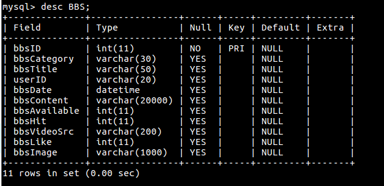

No Food No Life
================
  
### 17.06.12 update

1. MRBS(my recipes board system), MRCMT(my recipe comment) 데이터베이스 구축
>  
>  
2. 나의 레시피 게시판 구현
3. 나의 레시피 게시판의 게시글중 추천수가 10 이상인 게시물은 베스트 레시피 게시판에 노출
4. 검색기능 MRBS 데이터에 모두 적용
5. NBS(notice board system) 데이터베이스 구축
>  
6. 공지게시판 구현
7. 사용자별 세션 권한 적용

  
### 17.06.11 update

1. 단일 이미지 업데이트 기능 추가
2. 회원가입폼 비밀번호 확인 기능 등 기본 기능 추가
3. 메인페이지 디자인 적용
4. 동영상을 삽입하지 않았음에도 null 링크가 발생하는 버그 픽스
5. 게시글을 삭제하고 게시글 번호를 바꾸면 댓글위치가 바뀌는 버그 픽스
6. RBS, RCMT 데이터베이스 구축
>  
>  
7. 레시피 게시판구현 및 카테고리별로 페이징 기능 구현
8. 제목/내용/카테고리/글쓴이에 따른 검색 기능 구현

  
### 17.06.07 update

1. 디자인 적용
>  
>  
>  
2. 글삭제 시 글번호가 재정렬 되도록 구현, 글삭제 방식 변경(bbsAvailable 값 변경하지 않고 디비에서 직접삭제)
3. 게시글에 포함된 댓글이 삭제 되도록 구현
4. 회원가입시 USER 디비 row=0이 아니면 메인페이지로 넘어가지 않는 현상 수정
5. 게시글 목록에 댓글 개수가 노출 되도록 구현

  
### 17.06.06 update

#### 1. 게시판(BBS, bulletin board system)
>  
> <li>게시글 쓰기: 타이틀, 게시글 내용 등 저장, YouTube 동영상 링크 저장하여 inframe으로 재생가능</li>
> <li>게시글 수정: 게시글 번호의 값을 참조하여 타이틀, 게시글 내용, 동영상 링크 수정가능</li>
> <li>게시글 삭제</li>
> <li>게시글 조회: 게시글 번호의 값을 참조하여 BBS 데이터베이스에 있는 필드값 조회, 조회수 카운트, 추천기능 추가</li>
> <li>게시글 리스트: 게시글 번호의 오름차순으로 정렬, 데이터베이스에 있는 값을 일부 보여줌, 페이징기능 추가</li>

#### TODO:게시판 종류에 따라 3가지 테이블 구성 및 적합한 UI 구현 
<ul>(1) 레시피(RBS, recipe board system) - bbsLike column 삭제, 관리자만 글쓰기 가능, 카테고리별로 모아보기 구현
  ex) rbsID, rbsCategory...등으로 column name 변경
</ul>
<ul>(2) 커뮤니티(MRBS, my recipe board system): 나의 레시피/베스트 레시피  추천수가 10 이상인 레시피 글이 베스트 레시피 리스트에 노출</ul>
<ul>(3) 자유게시판(BBS): 기존 게시판과 동일</ul>

#### 2. 댓글(CMT, comment)
>  
> <li>댓글 쓰기: 댓글 내용 등 저장</li>
> <li>댓글 수정: 댓글 번호의 값을 참조하여 내용 수정가능</li>
> <li>댓글 삭제</li>
> <li>댓글 리스트: 댓글 번호의 내림차순으로 정렬, 데이터베이스에 있는 값을 일부 보여줌, 페이징기능 없음</li>

#### TODO:게시판 종류에 따라 3가지 댓글 테이블 구성 
<ul>(1) 레시피(RCMT, recipe comment) - bbsID column을 rbsID column으로 변경</ul>
<ul>(2) 커뮤니티(MRCMT, my recipe comment) - bbsID column을 mrbsID column으로 변경</ul>
<ul>(3) 자유게시판(CMT, comment)</ul>

  

## 주제 및 목표
> **1. 주제: 요리 레시피 제공 사이트**  
> **2. 목표: 사용자가 가진 재료에 알맞은 레시피를 찾을 수 있도록 돕는다.**
>> <li> 검색 시 재료를 체크박스(혹은 텍스트) 형태로 입력받아 재료에 알맞은 레시피를 제공한다.</li>
>> <li> 카테고리별 추천 요리와 해당 요리의 레시피/영상을 제공한다.</li>
>> <li> 유저가 레시피를 올리는 공간을 마련해 레시피의 다양성을 증진한다.</li>
>> <li> 유저간의 커뮤니티 활동을 통해 요리 팁을 공유하게 유도한다.</li>

## 개발 동기 및 배경
> 요리는 대개 두 가지의 방법으로 만들어진다.첫째는 레시피를 보고 재료를 구비하여 요리를 만드는 경우, 둘째는 있는 재료를 가지고 요리를 만드는 경우. 전자의 경우에는 처음부터 시간을 넉넉하게 잡고 여유로운 상태에서 요리를 하게 되므로 아무런 문제가 발생하지 않는다.  
  하지만 후자의 경우라면 이야기는 달라진다. 집에 있는 재료로 요리를 만들려 하는 사람은 한정된 재료를 가지고 있으며 보통 배가 고픈 상태이다. 즉, 빠른 시간 내에 먹을만한 요리를 만들 필요가 있다는 것이다. 그러나 요리를 하기엔 재료에 마땅한 레시피를 찾기위한 시간 소요가 크다.  
  배가 고프지 않은 사람은 집에 있는 재료로 만들 음식을 검색해보지만 추가적인 재료가 더 필요함을 알게 된다. 재료가 한 두 가지만 더 추가된다면 모를까, 결론은 배보다 배꼽이 큰 실정이다. 결국 요리 레시피 검색에 실패하고 만다.  
  이러한 문제를 해결하기 위해 현재 가지고 있는 재료를 바탕으로 레시피를 검색할 수 있는 사이트를 만들기로 했다. 기본적으로 요리 레시피를 제공하는데 더불어 해당 기능을 추가하고, 나아가 사용자의 이해를 위해 레시피에 대한 영상이 함께 있으면 좋겠다고 생각했다.  

## 페이지 구성
> - **메인 페이지**
> - **소개페이지**
>> 1. 소개글: 사이트 이름&취지 소개
>> 2. 이용방법/사이트가이드
> - **레시피: 카테고리**
>> 1. 간단/자취
>> 2. 한식
>> 3. 중식
>> 4. 일식
>> 5. 양식
>> 6. 디저트
> - **커뮤니티**
>> 1. 나만의 레시피
>> 2. 베스트 레시피: 회원들이 올린 레시피 중 추천(공감)을 일정 수 이상 받은 글을 모아놓은 곳(직접 글쓰기 불가능)
>> 3. 자유게시판: 요리팁, 요리관련 질문, 잡담의 세 가지 말머리로 분류되어 있음
> - **공지&QnA**

## 개발자
> - snowflake-1117(1117hyemin@gmail.com)
> - HyoeunKwon(oasis_1205@naver.com)
> - su100(zxctys@naver.com) 
